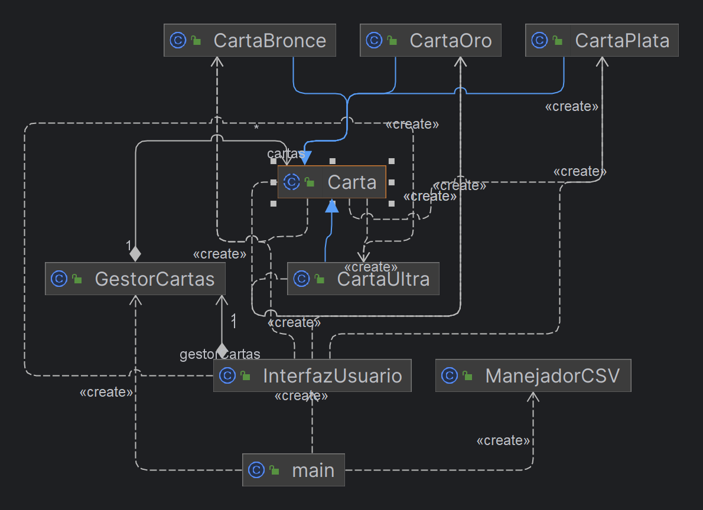

# Proyecto de Cartas en Java

## Descripción General

Este proyecto implementa un sistema de gestión de cartas en Java. Permite a los usuarios crear, modificar, eliminar y visualizar diferentes tipos de cartas, como CartaBronce, CartaPlata y CartaOro. Las cartas se pueden guardar y cargar desde archivos CSV.

## Para Usuarios

### Instalación

(Describe aquí cómo los usuarios pueden instalar o configurar tu programa. Por ejemplo, si necesitan descargar archivos JAR o configurar un entorno de Java.)

### Uso

1. Ejecute el programa desde la línea de comandos o a través de su IDE.
2. Utilice el menú interactivo para navegar por las diferentes opciones:
    - Agregar nueva carta
    - Eliminar carta existente
    - Modificar carta existente
    - Mostrar todas las cartas
    - Salir del programa

(Los pasos específicos o comandos pueden variar dependiendo de tu implementación.)

## Para Desarrolladores

### Estructura del Proyecto

El proyecto está organizado en varios paquetes:

- `dominio`: Contiene las clases que definen la estructura de las cartas (`Carta`, `CartaBronce`, `CartaPlata`, `CartaOro`).
- `aplicacion`: Incluye las clases `GestorCartas` para la lógica de negocio y `ManejadorCSV` para la lectura/escritura de archivos CSV.
- `presentacion`: Contiene `InterfazUsuario` para la interacción con el usuario.

### Diagrama UML

(Reemplaza `url-de-tu-imagen-aqui` con la URL de tu imagen del diagrama UML o el path relativo al archivo en tu repositorio.)

### Contribuir

(Explica cómo otros desarrolladores pueden contribuir al proyecto. Incluye instrucciones sobre cómo hacer fork, crear ramas, enviar pull requests, etc.)

### Ejecutar Tests

(Describe cómo los desarrolladores pueden ejecutar pruebas unitarias o de integración, si las hay.)

## Licencia

(Especifica la licencia bajo la cual se distribuye el proyecto, por ejemplo, MIT, GPL, etc.)

## Autores

- David Abarca

---

Proyecto desarrollado para [Nombre de la Institución o Propósito del Proyecto].
